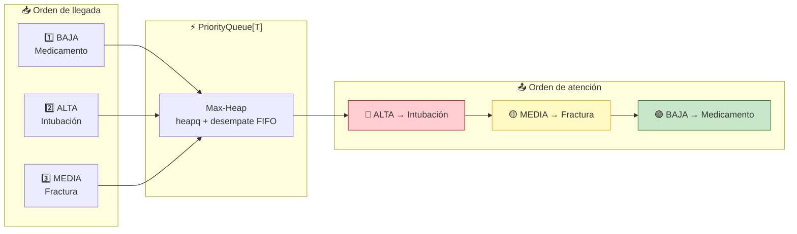
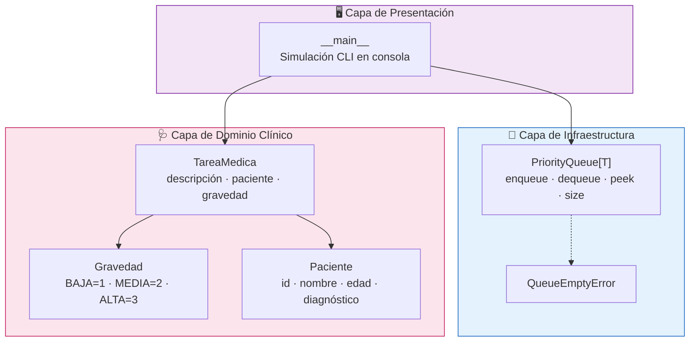
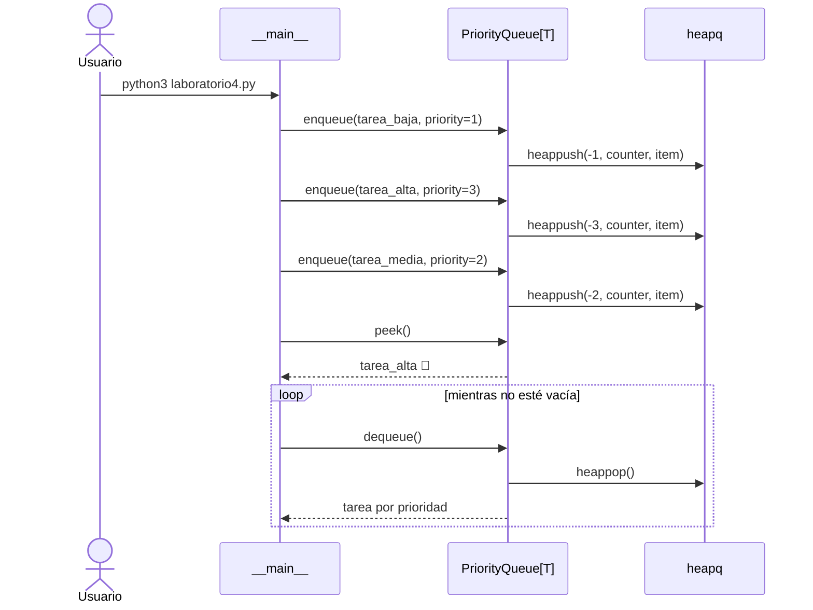
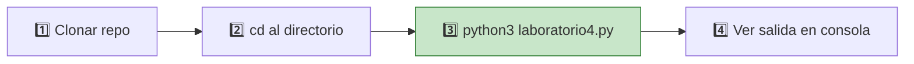
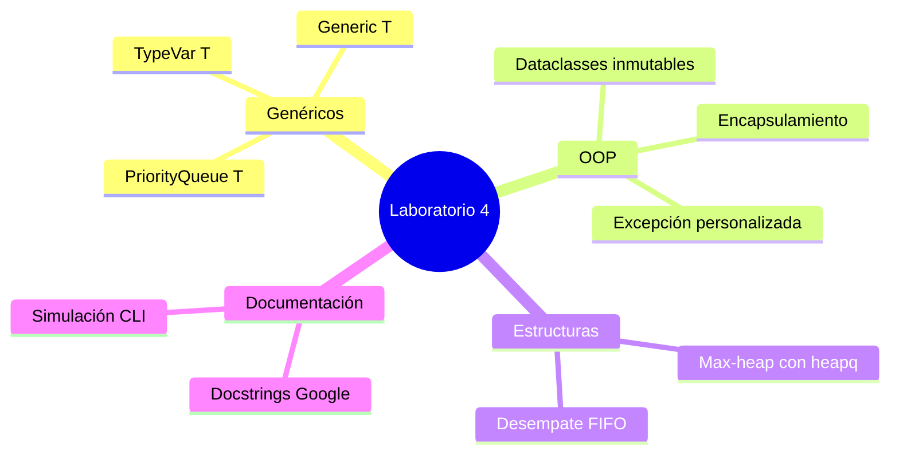

<div align="center">

# 🏥 4LabGenericos

**Cola de prioridad genérica en Python · Caso de urgencias hospitalarias**


<br/>


</div>

---

## 🎯 ¿Qué hace este proyecto?

Este repositorio implementa una **`PriorityQueue[T]`** genérica en Python puro y la aplica a un **servicio de urgencias hospitalarias**. Las tareas clínicas llegan en cualquier orden, pero el sistema las procesa **siempre por gravedad médica**, no por orden de llegada.



| Pregunta | Respuesta |
|:--|:--|
| **¿Qué es?** | Laboratorio 4 — *Tópicos Especiales de Programación* (UCAB) |
| **¿Qué problema resuelve?** | Ordenar tareas por prioridad clínica, independiente del orden de encolado |
| **¿Cómo?** | Max-heap genérico con `heapq` + modelo de dominio hospitalario |
| **¿Dependencias?** | Ninguna — solo biblioteca estándar de Python |

---

## 🧠 Idea central en 30 segundos

```
  ORDEN DE LLEGADA          COLA DE PRIORIDAD           ORDEN REAL DE ATENCIÓN
  ─────────────────         ─────────────────           ─────────────────────

  ① BAJA  ──┐                                          🔴 ALTA  (prioridad 3)
  ② ALTA  ──┼──►  [ heap interno ]  ──dequeue()──►     🟡 MEDIA (prioridad 2)
  ③ MEDIA ──┘                                          🟢 BAJA  (prioridad 1)

        ❌ No es FIFO                    ✅ Es "el más grave primero"
```

> 💡 **Insight clave:** `heapq` en Python implementa un *min-heap*. Multiplicamos la prioridad por `-1` para simular un **max-heap** sin reescribir el algoritmo.

---

## 🏗️ Arquitectura del módulo

El proyecto es un **monolito de un solo archivo** organizado en tres capas bien separadas:



### Diagrama de clases

```mermaid
classDiagram
    class PriorityQueue~T~ {
        -list _queue
        -counter _counter
        +enqueue(item, priority)
        +dequeue() T
        +peek() T
        +is_empty() bool
        +size() int
    }

    class QueueEmptyError {
        <<Exception>>
    }

    class Gravedad {
        <<IntEnum>>
        BAJA = 1
        MEDIA = 2
        ALTA = 3
    }

    class Paciente {
        <<dataclass frozen>>
        +str id_paciente
        +str nombre
        +int edad
        +str diagnostico
    }

    class TareaMedica {
        <<dataclass frozen>>
        +str descripcion
        +Paciente paciente
        +Gravedad gravedad
    }

    PriorityQueue --> QueueEmptyError : lanza
    TareaMedica --> Paciente : contiene
    TareaMedica --> Gravedad : usa
    PriorityQueue ..> TareaMedica : T = TareaMedica
```



---

## ⚙️ Cómo funciona el Max-Heap

Cada entrada en la cola es una tupla de tres elementos:

```
┌─────────────────────────────────────────────────────────────┐
│  entry = ( -prioridad ,  contador ,  item )                 │
│             ▲               ▲          ▲                     │
│             │               │          └── Tu objeto T       │
│             │               └── Desempate FIFO (itertools)   │
│             └── Signo invertido → max-heap con heapq         │
└─────────────────────────────────────────────────────────────┘
```

### Visualización del heap durante la simulación

Después de encolar las 3 tareas (BAJA → ALTA → MEDIA), el heap interno queda así:

```
                    ┌─────────────────┐
                    │  (-3, 1, ALTA)  │  ◄── raíz: mayor prioridad
                    └────────┬────────┘
              ┌──────────────┴──────────────┐
     ┌────────┴────────┐         ┌─────────┴─────────┐
     │ (-2, 2, MEDIA)  │         │  (-1, 0, BAJA)   │
     └─────────────────┘         └───────────────────┘

     peek()  →  Tarea ALTA  (intubación)
     dequeue →  extrae ALTA, reordena heap
     dequeue →  extrae MEDIA
     dequeue →  extrae BAJA
```

### Flujo de operaciones



---

## 🚦 Niveles de prioridad clínica

| Nivel | Valor | Badge | Ejemplo en la simulación |
|:-----:|:-----:|:-----:|:--|
| 🔴 **ALTA** | `3` |  | Intubación por dificultad respiratoria |
| 🟡 **MEDIA** | `2` |  | Reducción de fractura abierta |
| 🟢 **BAJA** | `1` |  | Suministrar medicamento programado |

---

## 🚀 Quick Start



**Paso 1 — Clona o entra al directorio**

```bash
git clone <url-del-repo>
cd 4LabGenericos
```

**Paso 2 — (Opcional) Entorno virtual**

```bash
python3 -m venv .venv
source .venv/bin/activate   # macOS / Linux
# .venv\Scripts\activate    # Windows
```

**Paso 3 — Ejecuta la simulación**

```bash
python3 laboratorio4.py
```

**Paso 4 — Salida esperada**

```
========================================================================
============ SISTEMA DE GESTION DE EMERGENCIAS HOSPITALARIAS ===========
========================================================================

[Ingreso de tareas en orden de llegada (mezclado)]
 + Encolada: Tarea: Suministrar medicamento...  | Prioridad: BAJA
 + Encolada: Tarea: Intubacion...              | Prioridad: ALTA
 + Encolada: Tarea: Reduccion de fractura...   | Prioridad: MEDIA

[Procesamiento por prioridad medica]
 > Ejecutando: ... Intubacion ...              | Prioridad: ALTA   🔴
 > Ejecutando: ... Reduccion de fractura ...   | Prioridad: MEDIA  🟡
 > Ejecutando: ... Suministrar medicamento ... | Prioridad: BAJA   🟢
```

> ✅ **Sin `pip install`**, sin Docker, sin `.env`. Solo Python 3.10+.

---

## 📁 Estructura del proyecto

```
4LabGenericos/
│
├── 📄 laboratorio4.py          ← Módulo único (todo vive aquí)
│   │
│   ├── 🔴 QueueEmptyError      Excepción personalizada
│   ├── 🔵 PriorityQueue[T]     Cola genérica (max-heap)
│   ├── 🟠 Gravedad             Enum de prioridad médica
│   ├── 🟢 Paciente             Dataclass inmutable
│   ├── 🟣 TareaMedica          Dataclass de acción clínica
│   └── ▶️  __main__             Entry point CLI
│
└── 📖 README.md
```

---

## 🛠️ Stack tecnológico

<table>
<tr>
  <td align="center"><br/><strong>🐍 Python 3.10+</strong><br/><sub>Lenguaje core</sub><br/><br/></td>
  <td align="center"><br/><strong>🔤 TypeVar + Generic</strong><br/><sub>Genéricos</sub><br/><br/></td>
  <td align="center"><br/><strong>📊 heapq</strong><br/><sub>Max-heap simulado</sub><br/><br/></td>
  <td align="center"><br/><strong>📦 dataclasses</strong><br/><sub>frozen + slots</sub><br/><br/></td>
  <td align="center"><br/><strong>🏷️ enum.IntEnum</strong><br/><sub>Prioridades tipadas</sub><br/><br/></td>
</tr>
<tr>
  <td align="center" colspan="5">
    <br/>
    
    
    
    
    <br/><br/>
  </td>
</tr>
</table>

### Requisitos previos

| Herramienta | Versión | ¿Obligatorio? |
|:--|:--|:--:|
| Python | ≥ 3.10 | ✅ Sí |
| pip / venv | Cualquiera | ⚪ Opcional |
| Docker | — | ❌ No |
| Node.js | — | ❌ No |

```bash
python3 --version   # debe mostrar 3.10 o superior
```

---

## 🔌 Reutilizar la cola en otro módulo

```python
from laboratorio4 import PriorityQueue, QueueEmptyError, TareaMedica, Paciente, Gravedad

cola: PriorityQueue[TareaMedica] = PriorityQueue()

paciente = Paciente("P-004", "María López", 28, "Crisis asmática")
tarea = TareaMedica("Nebulización urgente", paciente, Gravedad.ALTA)

cola.enqueue(tarea, priority=int(Gravedad.ALTA))
print(cola.peek())       # muestra sin extraer
siguiente = cola.dequeue() # extrae la de mayor prioridad
```

---

## ✅ Criterios de evaluación cubiertos



| Criterio | Implementación |
|:--|:--|
| Genéricos | `TypeVar("T")` + `class PriorityQueue(Generic[T])` |
| Encapsulamiento | `self._queue`, `self._counter` privados |
| Excepción propia | `QueueEmptyError` en `dequeue()` y `peek()` |
| Docstrings | Estilo Google en todas las clases y métodos |
| Demostración | `peek()`, `size()`, loop de procesamiento por prioridad |

---

## 🎓 Contexto académico

> **Nota:** Este repositorio **no forma parte** del ecosistema MM4D (`mm4d-api` / `mm4d-console`). Es un laboratorio independiente de *Tópicos Especiales de Programación* — UCAB.

| Aspecto | Detalle |
|:--|:--|
| Tipo | Script CLI / módulo Python ejecutable |
| Interfaz | Consola estándar (`stdout`) |
| Persistencia | En memoria — sin base de datos |
| Variables de entorno | No aplica — datos embebidos en `__main__` |
| Licencia | Académica UCAB |

---

<div align="center">

**Laboratorio 4 · Genéricos en Python · UCAB 2026**

<br/>


</div>
